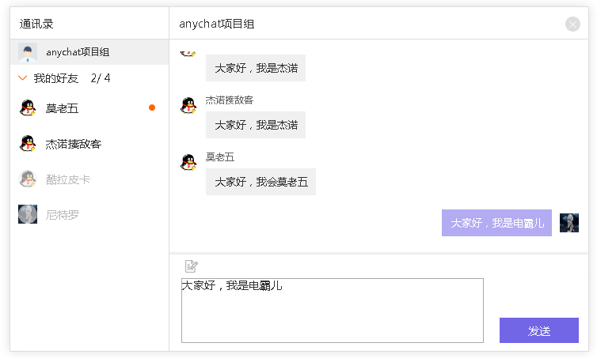

# anychat

## anychat是一个极简纯净的websocket聊天插件，支持对接任何身份系统、组织架构，嵌入方只需提供三个API即可进行实时通讯，支持个人与个人聊天、群聊天等。

## 截图

## 体验地址：

https://www.threecss.com/AnyChatClient/third-embed-demo.html

## 内部流程图

## 优势：

	1、合理的线程归属设计，登录、离线、断线归属线程1，其他业务归属随机线程。
	2、服务器掌握绝对的控制权，消息首先推送至每个人的消费队列，每个线程再进行轮训推送消息。
	3、第三方身份系统只需提供身份验证、好友列表或组织成员列表、获取组信息三个api即可完成对接，进行聊天。
	4、支持嵌入式，通过iframe即可进行嵌入
	<iframe src="https://ip:port/AnyChatClient/index.html?token=5ffdefd0e1104ebdbc49cc6de538b669"></iframe>
	5、支持聊天记录存入MongoDB，提高性能。
	
	
## 项目目录结构：

### AnyChatServer（目录结构 3276行）

	|--src.main.java（服务器代码）
		|--AnyChatServer.properties---------------配置文件（需要修改）
		|--generatorConfig.xml--------------------mybatis自动生成配置文件（重新生成时，需要修改）
		|--org.anychat
			|--action.IdentityAction.java---------从第三方身份系统获取数据（对接非默认身份系统时，需要修改）
			|--init.InitServlet-------------------启动类
			|--mongodb----------------------------聊天记录存储至mongodb的扩展包（如果不用mongodb，此包没用）
			|--plugin.PaginationPlugin.java-------mybatis自动生成配置文件启动类
			
	|--protobuf（消息包生成工具）
	

### AnyChatClient（912行代码）

	|--js（js库）
		|--anychat（anychat文件夹）
			|--css（anychat css）
			|--dist（anychat js打包版本）
			|--images（anychat image）
			|--src（anychat js未打包版本）
		|--lib（依赖js）
			|--jquery.min.js
			|--juggle-all.js（解耦合的工具库：https://github.com/dianbaer/juggle）
			|--jquery.mCustomScrollbar.concat.min.js
	|--third（third-embed-demo.html使用的样式）
	|--index.html（示例启动项目，需要修改链接AnyChatServer地址）
	|--third-embed-demo.html（第三方嵌入index.html示例）
	

## 与第三方身份系统对接

默认代码对接身份系统为：

https://github.com/dianbaer/startpoint

https://gitee.com/dianbaer/startpoint

如果对接其他身份系统，需要提供三个API

修改AnyChatServer/src/main/java/org/anychat/action/IdentityAction.java，返回需求的参数即可

	1、校验身份，返回用户信息
	2、返回好友列表
	3、返回组织信息

	
### 嵌入与对接流程图

	
## 打版本：在项目根目录下，执行

	ant

## AnyChatClient js源码打包

	cd AnyChatClient/js/anychat
	
	npm install -g grunt-cli

	npm install
	
	grunt
	
	
## 推荐环境：

>快捷部署 https://github.com/dianbaer/deployment-server

	jdk-8u121

	apache-tomcat-8.5.12

	MariaDB-10.1.22

	CentOS-7-1611
	
	mongodb-3.4.3（可选）

	支持Html5浏览器
	
	
## 发布项目：

>1、安装数据库
	
	create database anychat
	
	source ****/anychat.sql
	
>2、安装MongoDB数据库（通过配置可选）

	mongo --host 0.0.0.0 --eval 'db = db.getSiblingDB("anychat");db.createUser({user: "anychat",pwd: "123456",roles: [ "readWrite", "dbAdmin" ]})'

>3、将ChatConfig放入服务器某个路径，例如
	
	/home/AnyChatConfig

>4、将AnyChatServer.properties放入tomcat根目录下，例如
	
	/home/tomcat/AnyChatServer.properties
	
	并修改config_dir对应的AnyChatConfig路径

>5、将AnyChatClient与AnyChatServer.war放入tomcat/webapps，例如
	
	/home/tomcat/webapps/AnyChatServer.war
	
	/home/tomcat/webapps/AnyChatClient
	
	

## java服务器基于grain-threadwebsocket等

github：

https://github.com/dianbaer/grain

码云：

https://gitee.com/dianbaer/grain

## js客户端基于juggle-event，juggle-mv，juggle-websocket

github：

https://github.com/dianbaer/juggle

码云：

https://gitee.com/dianbaer/basic
	
	