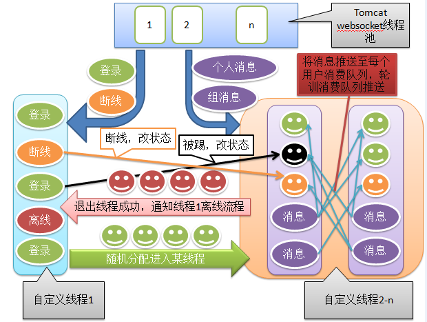
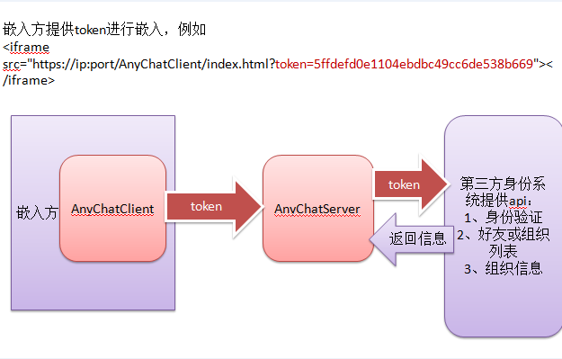

# anychat

## anychat是一个极简纯净的websocket聊天插件，支持对接任何身份系统、组织架构，嵌入方只需提供三个API即可进行实时通讯，支持个人与个人聊天、群聊天等。

### 内部流程图

### 嵌入流程图

## 优势：

	1、合理的线程归属设计，登录、离线、断线归属线程1，其他业务归属随机线程。
	2、服务器掌握绝对的控制权，消息首先推送至每个人的消费队列，每个线程再进行轮训推送消息。
	3、第三方身份系统只需提供身份验证、好友列表或组织成员列表、获取组信息三个api即可完成对接，进行聊天。
	4、支持嵌入式，通过iframe即可进行嵌入
	<iframe src="https://ip:port/AnyChatClient/index.html?token=5ffdefd0e1104ebdbc49cc6de538b669"></iframe>
	5、支持聊天记录存入MongoDB，提高性能。

### AnyChatServer（目录结构 3276行）

	|--src.main.java（服务器代码）
		|--AnyChatServer.properties---------------配置文件（需要修改）
		|--generatorConfig.xml--------------------mybatis自动生成配置文件（重新生成时，需要修改）
		|--org.anychat
			|--action.IdentityAction.java---------从第三方身份系统获取数据（需要修改）
			|--init.InitServlet-------------------启动类
			|--mongodb----------------------------聊天记录存储至mongodb的扩展包（如果不存入mongodb，此包没任何意义）
			|--plugin.PaginationPlugin.java-------mybatis自动生成配置文件启动类
			
	|--protobuf（消息包生成工具）
	
	
	
	
	
## 打版本：在项目根目录下，执行

	ant
	
	
	
## 推荐环境：

>快捷部署 https://github.com/dianbaer/deployment-server

	jdk-8u121

	apache-tomcat-8.5.12

	MariaDB-10.1.22

	CentOS-7-1611
	
	mongodb-3.4.3（可选）

	支持Html5浏览器
	
	